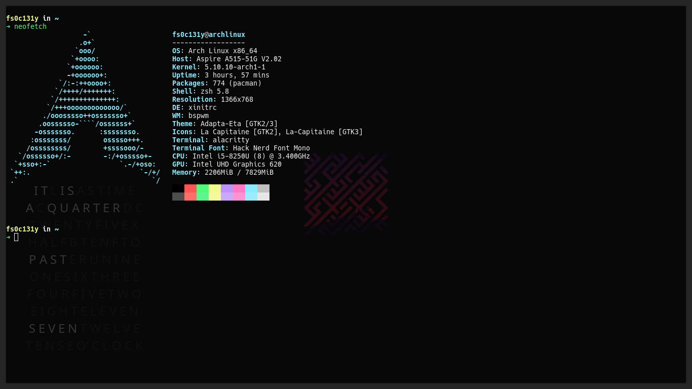
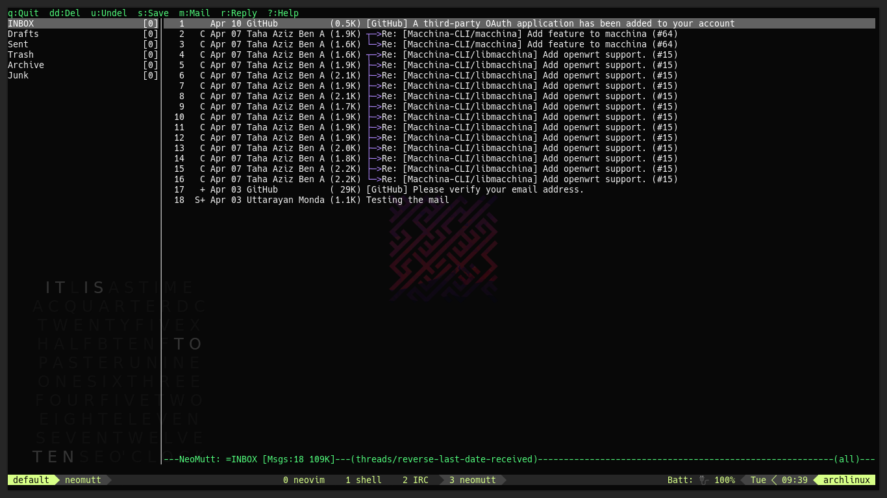
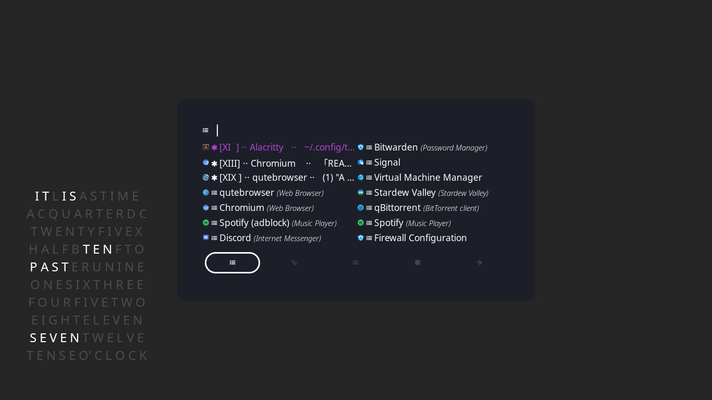
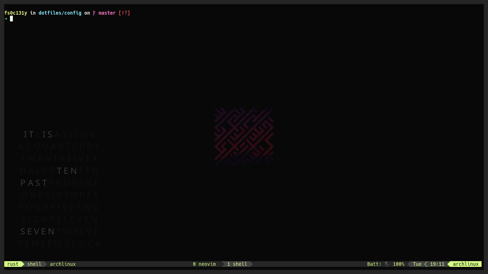
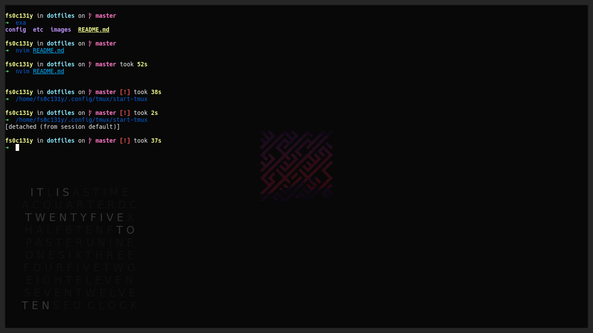
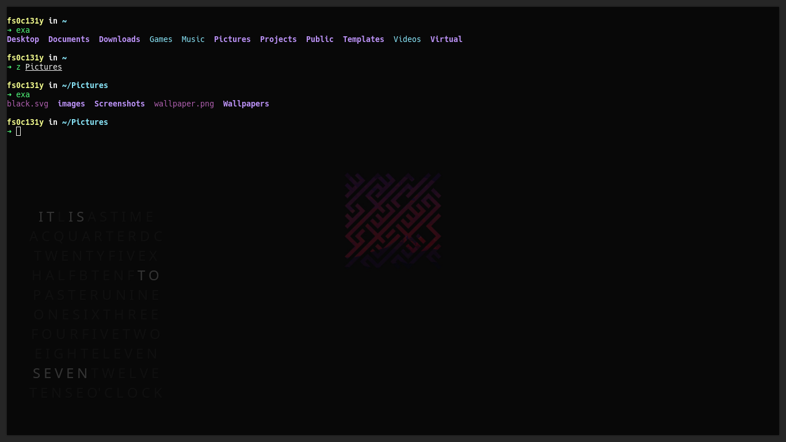

## Dotfiles

These are dotfiles for my linux machine

Includes the dotfiles for

- [alacritty](#alacritty)
- [bspwm](#bspwm)
- [conky](#conky)
- [neovim](#neovim)
- [neomutt](#neomutt)
- [picom](#picom)
- [rofi](#rofi)
- [sxhkd](#sxhkd)
- [tmux](#tmux)
- [fish](#fish)
- [zsh](#zsh)

### alacritty

### bspwm

[bspwm](https://github.com/baskerville/bspwm)

### conky

### neovim

### neomutt

### picom

[picom](https://github.com/yshui/picom)

### rofi

### sxhkd

[sxhkd](https://github.com/baskerville/sxhkd)

### tmux

### fish

### zsh

